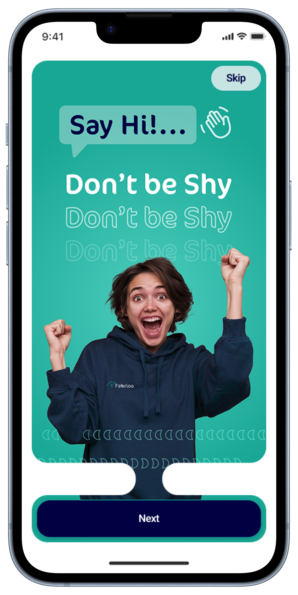

# Fabrioo — Smart Clothing Landing Page 👕✨


A responsive **landing page** for **Fabrioo**, a smart clothing experience designed for **everyday comfort, wellbeing, and performance**.  
This project was built as a **training/practice project** to improve front-end skills while keeping a clean UI, consistent branding, and a production-ready structure.

## 🔗 Live Website

**Netlify:** https://fabrioo.netlify.app/

---

## 📸 Preview

> These images are already included in the project.




---

## ✅ Key Highlights

- **Bootstrap 5 responsive layout** (mobile-first)
- **Bootstrap Navbar/Header** + smooth section navigation
- **Consistent design system** using CSS `:root` color tokens (primary / secondary / accent / neutrals)
- **Gallery carousel** for app screens (Bootstrap Carousel)
- **FAQ accordion** (Bootstrap Accordion)
- **Newsletter form validation** (Bootstrap validation styles + JS)
- **Custom global font**: `"CoconÆ Next Arabic"` (via `@font-face`)

---

## 🧩 Sections Included

- Hero + App Store / Google Play badges
- Features
- Products
- Gallery (Carousel)
- FAQ
- Footer + Social Links + Newsletter

---

## 🛠 Tech Stack

- **HTML5**
- **CSS3** (Design Tokens via `:root`)
- **JavaScript (Vanilla JS)**
- **Bootstrap 5**  
  Docs: https://getbootstrap.com/docs/5.0/getting-started/introduction/
- **Font Awesome**  
  Docs: https://fontawesome.com/

---

## 🚀 How to Open / Run Locally

### Option 1 — Open directly

1. Download or clone the repo
2. Open `index.html` in your browser

### Option 2 — Run with a local server (recommended)

Using VS Code:

1. Install **Live Server** extension
2. Right-click `index.html` → **Open with Live Server**

Or using Node:

```bash
npx serve

.
├─ index.html
├─ css/
│  └─ style.css
├─ js/
│  └─ index.js
├─ images/
│  ├─ Logo.svg
│  ├─ mobile.png
│  ├─ PhoneMokups.png
│  ├─ HeroSec.svg
│  ├─ FAQBG.svg
│  ├─ slider/
│  └─ icons/
└─ fonts/
   ├─ CoconAE-Next-Arabic.woff2
   └─ CoconAE-Next-Arabic.woff
```

🎨 Design System

All branding colors are defined in css/style.css under :root and used across the whole UI:

Primary (Turquoise)

Secondary (Navy)

Accent (Orange)

Neutrals (Greys)

This ensures consistent styling and makes future theme edits easy.

🖋 Custom Font Setup

The project uses:

"CoconÆ Next Arabic" as the global font

Make sure the font files exist in:

fonts/CoconAE-Next-Arabic.woff2
fonts/CoconAE-Next-Arabic.woff

📦 Deployment

This site is deployed using Netlify:

https://www.netlify.com/

To deploy your own version:

Push the repo to GitHub

Connect it to Netlify

Set the build to a simple static site (no build command needed)

📄 License

This is a training project. If you plan to reuse or publish it commercially, ensure your assets (icons/fonts/images) are properly licensed.
